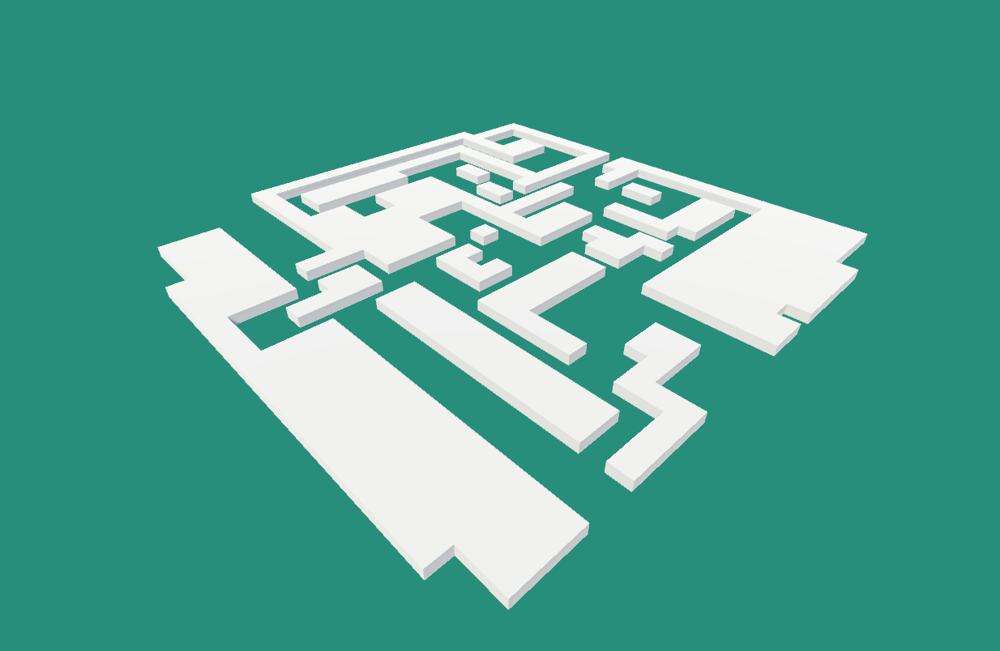
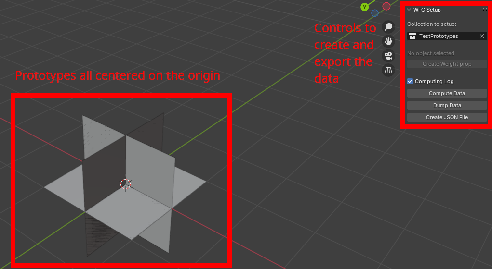
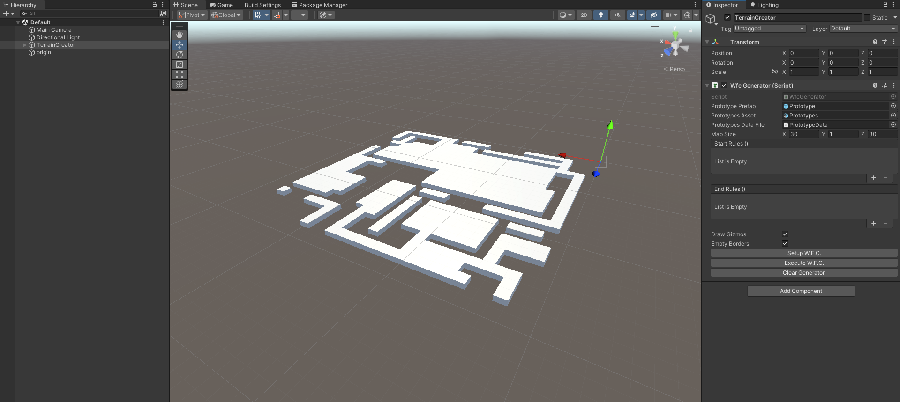
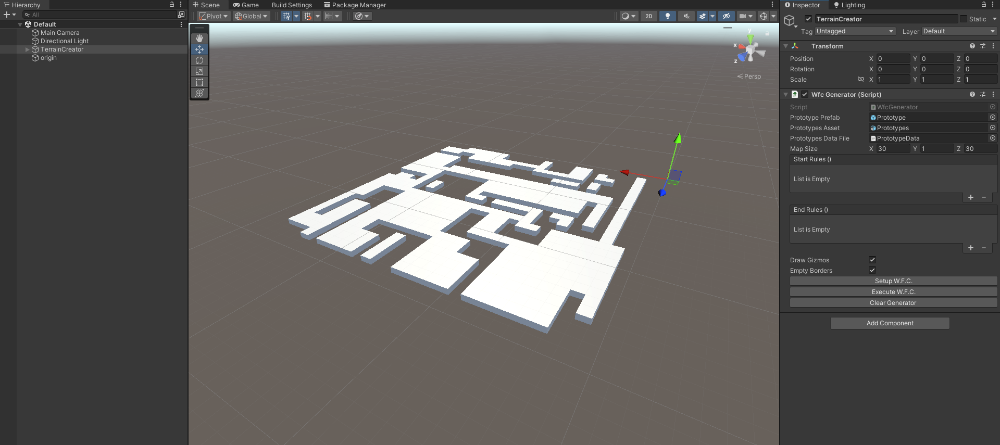

# Wave Function Collapse Implementation using Unity and Blender

This project was first created as part of my university curriculum. We had the opportunity to explore a technology we chose.
I came across [Maxim Gumin's Wave Function Collapse](https://github.com/mxgmn/WaveFunctionCollapse) implementation a while before and it really caught my attention.
I figured I would try to implement something similar to what he did.
I researched more of what people did with that algorithm and based my work on [Marian42's implementation](https://marian42.de/article/wfc/) and [Paul Merrel's Model Synthesis](https://paulmerrell.org/model-synthesis/). I also took notes from [Oskar Stålberg explanation of Bad North's implementation](https://www.youtube.com/watch?v=0bcZb-SsnrA).

- Maxim Gumin's 2D results:

- Marian42's Endless City:

- Paul Merrel's Model Synthesis:

# Basic principle

Wave Function Collapse is a concept borrowed [from quantum mechanics](https://en.wikipedia.org/wiki/Wave_function_collapse).
While that does sound fancy and very complicated, it is just a good way to describe how the algorithm work.

The first is making the essential building blocks that will be assembled. This can entail making a 2D tilemap, choosing pixel colours or making 3D models that fit together. Once you have your building blocks, you need to determine which blocks can go next to which. This information is called the adjacency rules. The algorithm is about enforcing the adjacency rules.

Once you have your building blocks, create a grid of cells that each contain every building block. Each cell is a superposition of all the blocks it could become, so long as we haven't chosen any block to start with.

To start the algorithm, you pick a random cell and choose a block for that cell among its possible blocks (this is called collapsing the cell).

Then, since we defined what can or cannot sit next to that block, we can remove the impossible blocks from the adjacent cells. We won't stop at just the adjacent cells however. Since we removed some possibilities from the adjacent cells, their neighbours also need to have their possibilities updated. Each time we update the possibilities of a cell, we need to update the possibilities of its neighbours, propagating the change.

Once we have finished propagating the change, we pick the cell that has the list amount of possibilities left and start that process again. We stop when there aren't any cells left to pick.

This is basically how you solve a sudoku but with different rules of adjacency and different building blocks.

# My implementation

Making the building blocks is rather simple: as long as you pick some form of unit for your blocks, you can stick to that unit and align the blocks fairly easily.
The annoying part is creating the adjacency rules. You need to go through each block and determine which other blocks fit next to them. When drawing pixels, this isn't too big a problem; but when in 3D, there are 6 neighbours that can each be rotated. Manually assigning them would take quite some time and would make iterating rather tedious. I needed to simplify that situation so I could automate the process.

Since it is completely free and open-source, I chose Blender to make the building blocks in 3D and automate the creation of the adjacency data. The robust Blender API and its great community were instrumental in getting this addon to work. Thanks especially to [Valy Arhal's](https://github.com/Valery-AA) help and [the references she gave me](https://github.com/Valery-AA/AlxOverHaul).

First, the models must fit within a unit cube, with their edges on the faces of said cube. This allows me to create face profiles for each side of the cube. If two face profiles match, they can fit together.  
Then, I constrained the rotation of the blocks. They only rotate around the vertical axis. Therefore, there are only 4 rotations possible for a unit cube.  
Once that is done, I need to create the adjacency data. The script goes through every model and identifies all possible face profiles and assigns them to the models. The association of face profiles and models is called a prototype. Each prototype is duplicated then rotated to create the prototypes for each rotation. While this makes the data significantly larger, it greatly simplifies the programming of the W.F.C. later on.  
With each prototype created, we can check which fit with which by just comparing face profiles. The data is ready to be exported to Unity.
I exported the data in a JSON file, both because it's easy thanks to Python's built-in library and because storing it on the FBX export would be hell to write and read from.  
With the data exported, we can export the collection containing the models after centering them all at the origin (all the models should sit in the same FBX file).

Moving over to Unity, I created a script that sets up a grid, imports the data from the JSON file, and recreates the prototypes using C# structures so that it can be used later. Then, I implemented the Wave function collapse algorithm and voilà:

While those results are fairly crude, they nonetheless demonstrate the potential for that tool: automated creation of terrain, like in Bad North, or just a tool to iterate on layouts that you can then follow with proper assets.

There are a few things on top of the base algorithm to make the generation more useful and coherent. First, there is an option for the user to make sure that the borders of the generator are empty, meaning that the models won't cut off at the edges of the generation zone. Then, the prototypes are welded, i.e. they have different probabilities to occur in the generation. This allows tweaking to have more ground then walls, longer walls, etc. Tweaking the generation is the best way to obtain the results you're looking for. This is also why there are events in the inspector that allow the user to further alter the generation when it starts and when it ends.

# Reflections on the project

While the implementation is solid and works in Unity, having the algorithm be executed in Unity was probably a mistake. The objective of tools are to help the people using them. Despite the usefulness to someone making a game on their own, this tool probably wouldn't fit properly in a bigger structure. There isn't really a good way for users to adjust the weights of the prototypes in the Unity Editor, needing to export every time you make a change is cumbersome, environments would be more easily constructed in Blender and then exported. Overall, users would benefit from this a lot more if they could iterate solely in Blender or solely in Unity.

The next step in that project is to implement the WFC algorithm straight in Blender for use by artists and technical artists. I also need to devise a guide to properly create models that fit the addon. Finally, some kind of way to override the prototype data to allow artists to set manually which models go with which would be nice.
